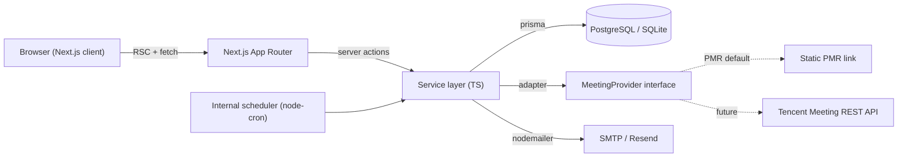

# TutorFlow — 1-on-1 Tutor Scheduler · Design Document

> A web-based scheduler for a single tutor to plan 1-on-1 courses, track
> per-student session balances (paid in advance, decremented by hour/session),
> and launch each lesson in VooV Meeting (Tencent Meeting) with one click.

---

## 1. Scope & Constraints


| Item             | Decision                                                                                         |
| ---------------- | ------------------------------------------------------------------------------------------------ |
| Users            | **Single tutor** (you) is the only authenticated user. Students do **not** log in.               |
| Course type      | 1-on-1 only. Same flat per-session price. Balance tracked in **hours / sessions**, not currency. |
| Meeting platform | **VooV Meeting** (Tencent Meeting / 腾讯会议).                                                       |
| Region           | Mainland-China-friendly stack (no hard dependency on services blocked behind GFW).               |
| Form factor      | Desktop-first responsive web app (works on tablet; mobile is "view + quick reschedule" only).    |
| Hosting          | Self-hostable (Docker on a small VPS / local) and Vercel-compatible.                             |


### VooV Meeting integration strategy (recommended)

The official Tencent Meeting REST API (`https://api.meeting.qq.com/v1`) requires
a paid **Enterprise / Business 2.0** account with ≥10 purchased virtual rooms,
which is overkill for a single tutor. We therefore design a **pluggable adapter**:

- **Default adapter — "Personal Meeting Room" (PMR)**: store one permanent
VooV meeting ID + URL on the tutor profile. Every session auto-inherits this
link. Joining is a single click; VooV opens the same room each time. Optional
per-session password override.
- **Override adapter — "Manual link per session"**: paste a meeting-specific
link/ID into any session that needs its own room (e.g. group makeup class).
- **Future adapter — "VooV REST API"**: drop-in `MeetingProvider` interface so
that when an Enterprise account is available, real per-session meetings can
be created via API without touching UI code.

The codebase ships with the **PMR adapter active** and a stub for the API
adapter. See [§7](#7-voov-meeting-integration).

---

## 2. Recommended Tech Stack


| Layer                 | Choice                                                                                                                     | Why this and not alternatives                                                                                                                                                                                                                                        |
| --------------------- | -------------------------------------------------------------------------------------------------------------------------- | -------------------------------------------------------------------------------------------------------------------------------------------------------------------------------------------------------------------------------------------------------------------- |
| Framework             | **Next.js 15 (App Router) + React 19 + TypeScript**                                                                        | Single full-stack codebase (no separate API server needed for one user). Best ecosystem for calendar/UI libs. Server Components keep the dashboard fast.                                                                                                             |
| Styling               | **Tailwind CSS v4 + shadcn/ui (Radix-based)**                                                                              | Matches the soft-cream / coral aesthetic in your reference image via CSS variables. Copy-paste components, no runtime cost, fully themable.                                                                                                                          |
| Icons                 | **lucide-react**                                                                                                           | Clean line icons identical in feel to the reference sidebar.                                                                                                                                                                                                         |
| Calendar widget       | **FullCalendar v7 React (`@fullcalendar/react`)** with `timegrid`, `daygrid`, `multimonth`, `interaction`, `rrule` plugins | The only mature React calendar that supports Outlook-style behavior out of the box: drag-to-create, drag-to-move, resize-to-extend, recurring events, and `multiMonthYear` (12-month grid). All needed views are **MIT-licensed**; no FullCalendar Premium required. |
| Charts                | **Recharts**                                                                                                               | Drop-in radar/bar/line for the dashboard widgets in your reference.                                                                                                                                                                                                  |
| State (server)        | **TanStack Query v5**                                                                                                      | Caching, optimistic updates for drag-to-reschedule.                                                                                                                                                                                                                  |
| State (client)        | **Zustand**                                                                                                                | Tiny store for calendar-view toggle, sidebar open/closed.                                                                                                                                                                                                            |
| Forms                 | **react-hook-form + zod**                                                                                                  | Type-safe validation shared with backend.                                                                                                                                                                                                                            |
| ORM / DB              | **Prisma + SQLite (dev) → PostgreSQL (prod)**                                                                              | Same schema both environments. SQLite is perfect for a single-user local install; one-line switch to Postgres for cloud.                                                                                                                                             |
| Auth                  | **Auth.js v5 (NextAuth)** with Credentials provider + bcrypt                                                               | Single tutor login. Magic-link or TOTP can be added later.                                                                                                                                                                                                           |
| Email / notifications | **Resend** (intl) **or** **Aliyun DirectMail / Tencent SES** (CN) via Nodemailer                                           | Configurable transport. Reminder emails to students 24h / 1h before session.                                                                                                                                                                                         |
| Realtime (optional)   | **Server-Sent Events** via Next.js streaming                                                                               | Live calendar updates if you have it open on multiple tabs.                                                                                                                                                                                                          |
| Deployment            | **Docker Compose** (`web` + `postgres`) + Caddy/Nginx reverse proxy. Vercel + Neon Postgres also supported.                | Works on a 1-vCPU VPS; cloud option available.                                                                                                                                                                                                                       |


### Why not other stacks

- **Separate Nest.js / FastAPI backend** — unnecessary for one user; doubles the
surface area to maintain.
- **Vue / Nuxt** — equally capable, but FullCalendar's React bindings and the
shadcn/ui ecosystem are more polished today.
- **react-big-calendar** — simpler, but lacks `multiMonthYear` and slot-resize
ergonomics; would need significant custom work.

---

## 3. Feature Specification

### 3.1 Core (from your requirements)

1. **Switchable views — Day / Week / Month / Year**
  - Day & Week → `timeGridDay` / `timeGridWeek` (hour rows, blocks render with
   time + student name + subject).
  - Month → `dayGridMonth` (chips per day, color-coded by student).
  - Year → `multiMonthYear` (12-month overview, dot density per day; click a
  day jumps to Day view).
  - Each view shows **progressively less detail** as the time scope widens
  (Outlook-style): time + title + subject + meeting badge → title only → density dot.
2. **Add a course** — two equivalent flows:
  - Top-right **"Book Session"** button → modal with student picker, subject,
   start/end, recurrence (rrule), notes.
  - **Click-and-drag on the calendar grid** to select a time range → modal
  prefilled with that range. Drag an existing event to move; drag its edge
  to resize.
3. **Pre-paid balance tracking**
  - Each top-up creates a **Package** record (hours purchased, optional price
   for reference only). The student's **balance** is *computed* from the sum
   of all packages minus consumed sessions — never stored as a separate
   mutable field, so the ledger is always self-consistent.
  - Booking a session **reserves** balance. Marking a session **completed**
  consumes it. **Cancelled-by-tutor** refunds the slot; **no-show /
  student-cancel-late** consumes it (policy configurable in Settings).
  - Low-balance warning chip on the student card when ≤ 2 sessions remain.
  - **Top-up history** ledger (date, hours added, optional note, optional
  price for the tutor's own records — never shown to students).
4. **VooV Meeting one-click join**
  - Each session row has a **"Join VooV"** button. Primary action opens the
   stored web join URL (`https://meeting.tencent.com/dm/...` or
   `https://wemeet.qq.com/...`); a secondary "Open in app" link attempts the
   `wemeet://` desktop deep-link scheme. Exact deep-link string is confirmed
   against the installed VooV client during Phase 5 — the data model only
   stores the canonical web URL + meeting code, so no schema change is
   needed if Tencent updates the scheme.
  - Meeting code resolution follows the adapter pattern in [§7](#7-voov-meeting-integration).
  - Student-facing **share link** can be copied to clipboard or sent via the
  reminder email.

### 3.2 Recommended additions (see [§8](#8-recommended-extra-features) for rationale)

- Recurring schedules with exceptions
- Conflict / double-booking prevention
- Color-coded by student (auto-palette) or by subject (manual)
- Per-session notes, homework attachments, post-class feedback
- Session lifecycle: `scheduled → ongoing → completed | cancelled | no-show`
- Student profiles with progress %, grade level, subjects, parent contact
- Reminders (email) at T-24h and T-1h, configurable per student
- Holiday / blackout dates (no booking allowed)
- Working-hours template (e.g. Mon–Fri 16:00–22:00, Sat 09:00–18:00)
- iCal `.ics` feed (read-only) for syncing to phone calendar
- CSV import/export of students, sessions, top-ups
- Data backup (one-click DB dump)
- Light / dark mode toggle (reference is light; design tokens support both)

---

## 4. Data Model

```prisma
model Tutor {
  id              String   @id @default(cuid())
  email           String   @unique
  passwordHash    String
  displayName     String
  voovPmrId       String?           // Personal Meeting Room ID
  voovPmrPassword String?
  workingHours    Json              // { mon: [{from,to}], ... }
  timezone        String   @default("Asia/Shanghai")
  createdAt       DateTime @default(now())
}

model Student {
  id            String     @id @default(cuid())
  name          String
  gradeLevel    String?
  subjects      Json       // string[] serialized; works on both SQLite & Postgres
  parentContact String?
  notes         String?
  colorHex      String     // auto-assigned for calendar
  archivedAt    DateTime?
  packages      Package[]
  sessions      Session[]
  createdAt     DateTime   @default(now())
}

model Package {
  id              String    @id @default(cuid())
  studentId       String
  hoursPurchased  Float
  pricePerSession Decimal?  // informational only
  purchasedAt     DateTime  @default(now())
  note            String?
  student         Student   @relation(fields: [studentId], references: [id])
}

model Session {
  id            String        @id @default(cuid())
  studentId     String
  subject       String
  startsAt      DateTime
  endsAt        DateTime
  status        SessionStatus @default(SCHEDULED)
  recurrenceId  String?       // groups instances of an rrule series
  rrule         String?       // RFC 5545 string, only on the master
  meetingUrl    String?       // override; null = use tutor PMR
  meetingCode   String?
  notes         String?
  homeworkUrl   String?
  feedback      Json?         // {punctuality, mastery, comment, ...}
  createdAt     DateTime      @default(now())
  student       Student       @relation(fields: [studentId], references: [id])

  @@index([startsAt, endsAt])
}

enum SessionStatus {
  SCHEDULED
  COMPLETED
  CANCELLED_BY_TUTOR
  CANCELLED_BY_STUDENT
  NO_SHOW
}
```

**Balance derivation** is computed, not stored:
`remainingHours = sum(packages.hoursPurchased) - sum(sessions where status consumes balance).durationHours`.
This avoids double-bookkeeping and makes audits trivial.

---

## 5. Architecture




Folder layout:

```
TutorScheduler/
  app/
    (dashboard)/
      page.tsx               # Dashboard (reference image)
      calendar/page.tsx      # Full-page calendar
      students/page.tsx
      students/[id]/page.tsx
      stats/page.tsx
      settings/page.tsx
    api/
      sessions/route.ts
      students/route.ts
      auth/[...nextauth]/route.ts
      ical/route.ts          # .ics feed
  components/
    calendar/                # FullCalendar wrapper + slot popover
    dashboard/               # KPI cards, charts
    forms/                   # BookSession, NewStudent, TopUp
    ui/                      # shadcn/ui primitives
  lib/
    meeting/                 # Adapter interface + PMR + (stub) Tencent
    db.ts                    # Prisma client
    auth.ts                  # NextAuth config
    balance.ts               # remaining-hours calculator
    rrule.ts                 # recurrence helpers
  prisma/
    schema.prisma
  styles/
    globals.css              # Tailwind + design tokens
```

---

## 6. UI / Aesthetic Specification

Distilled from your reference image, **adapted for single-tutor scope**:

### What to keep

- Dark vertical sidebar with rounded coral "active" pill.
- Cream/peach (`#FAF6F1`-ish) page background; pure-white cards with very soft
shadow and `12–16px` radius.
- Coral accent (`#E89478` family) for primary actions, progress bars, chart
highlights.
- Top header: greeting, "Schedule's looking efficient" subline, **Weekly
Utilization** progress bar, **Available Hours** counter, and primary action
buttons.
- Big weekly schedule grid with view-toggle pill (Day / Week / Month / Year).
- Three KPI charts at the bottom: **Personal Performance (radar)**, **Subject
Hours Taught (bar)**, **Weekly Session Volume (line)**.
- Right rail: **Student Profiles** list with sortable header, avatar, grade
level, and a circular **balance %** ring (replacing the reference's "Progress %").

### What to remove (single-tutor scope)

- "Tutors" sidebar item, "New Tutor" button, "Active Tutors" KPI tile.
- "Tutor Performance" framing → relabel to **"My Performance"**.
- Plural "Integrated" framing → simply **"Students"**.

### Design tokens (Tailwind v4 / shadcn CSS variables)

```css
:root {
  --background:      oklch(0.98 0.012 60);   /* cream */
  --foreground:      oklch(0.22 0.02 50);    /* near-black warm */
  --card:            oklch(1 0 0);
  --primary:         oklch(0.70 0.14 35);    /* coral */
  --primary-foreground: oklch(0.99 0 0);
  --accent:          oklch(0.92 0.04 60);    /* peach tint */
  --muted:           oklch(0.96 0.01 60);
  --sidebar:         oklch(0.22 0.015 60);   /* warm charcoal */
  --sidebar-active:  oklch(0.70 0.14 35);    /* coral */
  --ring:            oklch(0.70 0.14 35 / 0.4);
  --radius:          0.875rem;
}
```

Typography: **Inter** for UI, **Inter Tight** for headings (or Geist if user
prefers). Numerals tabular.

---

## 7. VooV Meeting Integration

```ts
// lib/meeting/provider.ts
export interface MeetingProvider {
  id: "pmr" | "manual" | "tencent-api";
  /** Returns the link/code that should be used for this session. */
  resolve(session: Session, tutor: Tutor): Promise<{
    joinUrl: string;       // wemeet:// or https://
    fallbackUrl: string;   // always https://
    code: string;
    password?: string;
    source: "pmr" | "session-override" | "api";
  }>;
}
```

- `PmrProvider` returns the tutor's static PMR every time.
- `ManualProvider` reads `session.meetingUrl` / `session.meetingCode`.
- `TencentApiProvider` (future) implements the OAuth-2 flow against
`POST https://api.meeting.qq.com/v1/meetings` and stores the returned
`meeting_id`/`join_url` back on the `Session`. Stub committed on day one,
guarded behind a feature flag.

The UI never branches on provider — it just renders `joinUrl` and a copy button.

---

## 8. Recommended Extra Features

Ranked by ratio of value to single-tutor implementation cost:

1. **Recurring sessions with exceptions** — most tutoring is weekly. Implement
  via RFC-5545 rrule on a master `Session`, with child overrides.
2. **Reminder emails (T-24h, T-1h)** — biggest no-show reduction. Cron job
  reads upcoming sessions and posts to SMTP.
3. **Conflict detection** — server-side check on save: any session overlap on
  the tutor's calendar fails with a clear message.
4. **Working-hours template & blackout dates** — calendar greys out invalid
  slots; drag-create is blocked there.
5. **Student progress note per session + homework attachment** — turns the
  tool into a teaching log, not just a calendar.
6. **iCal feed** — read-only `.ics` URL the tutor can subscribe to from any
  phone calendar app.
7. **Auto-archived completed sessions** — keep the active calendar fast.
8. **Quick-reschedule shortcut** — drag a session in week view to instantly
  move it; modal only opens on conflict.
9. **CSV import for students** — onboarding speed.
10. **Backup button** — one-click `pg_dump` / SQLite copy.

---

## 9. Front-End GUI Generation Prompts

These prompts are tuned for **v0.dev**, **Cursor's UI generation**, **Lovable**,
or **Figma Make**. They are deliberately framework-aware (Next.js + shadcn +
Tailwind) so the output drops into the codebase with minimal cleanup.

### Prompt A — Global shell + dashboard page

> Build a Next.js 15 + Tailwind v4 + shadcn/ui dashboard page named
> `app/(dashboard)/page.tsx` for a single-tutor 1-on-1 tutoring scheduler
> called **TutorFlow**. Use `lucide-react` icons.
>
> **Layout:** fixed left sidebar (240px, dark warm-charcoal `oklch(0.22 0.015 60)`, rounded outer
> corners 16px) with: app name "TutorFlow" at top, then nav items
> Dashboard, Calendar, Students, Stats, Settings. The active item has a coral
> pill background `oklch(0.70 0.14 35)` with white icon+label. Bottom of the
> sidebar shows the tutor's avatar + name and a small "Schedule up-to-date.
> Next session in 20 mins." caption inside a soft card, plus a small lightning
> icon in a coral circle.
>
> **Main content** on a cream page background `oklch(0.98 0.012 60)`:
>
> 1. Header row: left side greets "Welcome back, {name}!" with subline
>   "Schedule's looking efficient." Below the subline: a horizontal progress
>    bar labeled "Weekly Utilization · 65%" (coral fill on peach track) and a
>    text "Available Hours · 32 / 40". Right side: two pill buttons —
>    primary coral "Book Session" with calendar-plus icon, and outlined "New
>    Student" with user-plus icon. (Do NOT include a "New Tutor" button —
>    this is a single-tutor system.)
> 2. **Weekly Schedule (7-Day View)** card. Top-right of card has a segmented
>   pill toggle: Day | Week | Month | Year (Week selected). Body renders a
>    7-column grid (Mon–Sun) with hour rows from 08:00 to 23:00 in 1-hour
>    increments, plus a few sample colored event blocks (rounded 8px, soft
>    shadow) showing student name, subject, and time. Use 5 different soft
>    pastel hues for different students (coral, peach, sky, sage, lilac).
> 3. Three equal-width chart cards underneath:
>   - **My Performance** — Recharts radar chart with axes Punctuality,
>    Student Mastery, Student Feedback, Subject Mastery.
>   - **Subject Hours Taught (Weekly)** — grouped bar chart, x-axis Mon–Sat,
>   two bars per day (Math vs Science) using coral and warm-grey.
>   - **Weekly Session Volume (Past 4 Weeks)** — area-line chart, y-axis 0–40
>   Sessions, x-axis Jan 1 / Jan 2 / Wee 3 / Wee 4. Coral stroke, peach
>   gradient fill.
> 4. **Right rail** (320px): card titled "Students" with a "Sort: A-Z"
>   dropdown. Each row: round avatar, name, "Grade {n} {subject}", and a
>    circular ring on the right showing remaining-balance % with the percentage
>    in the center. Eight sample rows.
> 5. **Bottom KPI strip** (4 white cards in a row): "Total Students · 49",
>   "Sessions This Week · 24", "Avg. Feedback · 6.3 ★", "Class Hours Taught ·
>    Total 312".
>
> Cards: pure white, 14px radius, very soft shadow `0 1px 2px rgba(0,0,0,0.04), 0 8px 24px rgba(0,0,0,0.04)`. Use Inter font, tabular numerals for stats.
> Make the page fully responsive (collapse right rail under main on <1280px).

### Prompt B — Calendar page with FullCalendar

> Build `app/(dashboard)/calendar/page.tsx`. Use
> `@fullcalendar/react` with plugins `timegrid`, `daygrid`, `multimonth`,
> `interaction`, `rrule`. The calendar fills the viewport minus the sidebar.
> Toolbar (top-right of the calendar card): pill toggle Day | Week | Month |
> Year mapping to views `timeGridDay`, `timeGridWeek`, `dayGridMonth`,
> `multiMonthYear`. Top-left of the toolbar: today/prev/next chevrons and the
> current period label (e.g. "Mar 24 – 30, 2026").
>
> Behavior:
>
> - `selectable: true`, `editable: true`, `selectMirror: true`,
> `slotDuration: '00:30:00'`, `slotMinTime: '08:00'`, `slotMaxTime: '23:00'`.
> - On `select`, open a `<BookSessionDialog>` (shadcn `Dialog`) prefilled with
> the dragged range, with fields: Student (Combobox), Subject (Input),
> Start/End (DateTimePicker), Recurrence (Select: None / Weekly /
> Bi-weekly / Custom rrule), Notes (Textarea). Submit calls
> `POST /api/sessions`.
> - On `eventDrop` / `eventResize`, optimistically update via TanStack Query
> mutation, with rollback on conflict error.
> - Each event renders a custom node: bold student name, subject under it,
> small "VooV" pill if a meeting link is set. Background uses the student's
> `colorHex` at 18% opacity, left border at full opacity.
> - Click an event opens a `<SessionPopover>` with: time, student avatar,
> subject, "Join VooV" coral button (opens `wemeet://...`), Edit, Delete,
> Mark Completed.

### Prompt C — Book Session dialog

> Build `components/forms/BookSessionDialog.tsx` using shadcn/ui `Dialog`,
> `Form` (react-hook-form + zod), `Combobox`, `DateTimePicker`, `Select`,
> `Textarea`. Fields: Student (required, with avatar in the option row),
> Subject, Start, End (auto-suggest +1h after start), Recurrence (None /
> Weekly / Bi-weekly / Until date), Override meeting link (collapsible),
> Notes. Footer: secondary "Cancel", primary coral "Book Session". Show a
> live "After this booking: 12 sessions remaining" hint computed from the
> selected student's balance, in coral if ≤ 2.

### Prompt D — Student detail page

> Build `app/(dashboard)/students/[id]/page.tsx`. Two-column layout. Left
> column (sticky on desktop): big avatar, name, grade level, subjects as
> chips, parent contact, "Top up" coral button, "Edit" outlined button, and
> a circular ring showing remaining-sessions %. Right column tabs:
> **Sessions** (table with date, subject, status badge, "Join VooV" if
> upcoming), **Packages / Top-ups** (ledger of additions), **Notes / Homework**
> (per-session timeline). Use shadcn `Tabs`, `Table`, `Badge`. Empty states
> are warm and friendly.

### Prompt E — Color & spacing rules (paste with every prompt)

> Use these design tokens via Tailwind arbitrary values (do not hardcode hex):
> background `oklch(0.98 0.012 60)`, foreground `oklch(0.22 0.02 50)`, primary
> coral `oklch(0.70 0.14 35)`, accent peach `oklch(0.92 0.04 60)`, muted
> `oklch(0.96 0.01 60)`, sidebar `oklch(0.22 0.015 60)`. Default radius
> `0.875rem`. Soft shadow only. Inter font. Tabular numerals for any number
> larger than 9. Always include keyboard focus rings using `--ring`. Respect
> `prefers-reduced-motion`.

---

## 10. Development Roadmap

### 10.1 Deliverable and validation framework

Each phase is **done** only when both parts are true:

1. **Deliverable** — the listed artifacts exist in the repo (code, config, or
  docs) and are merged to `main` (or your release branch).
2. **Validation** — evidence that the deliverable works. Use a **layered**
  approach so speed stays high early on and rigor increases on risky phases:


| Layer                    | What it is                                                                                                                                      | When to use                                                    |
| ------------------------ | ----------------------------------------------------------------------------------------------------------------------------------------------- | -------------------------------------------------------------- |
| **A. Automated gate**    | `npm run lint`, `npm run typecheck`, `npm run build`; add `npm test` as soon as the first unit test exists (balance math, meeting URL builder). | **End of every phase** before merge.                           |
| **B. Manual checklist**  | The bullet list under each phase below; tick in the PR description or a one-row entry in `docs/QA_LOG.md` (date, phase, tester, pass/fail).     | **Every phase**; required for UI-heavy phases.                 |
| **C. Integration / E2E** | Playwright (or Cypress) flows: login → book session → assert DB or UI. Start small: one "happy path" in Phase 3, grow coverage in Phases 6–8.   | **From Phase 3 onward** for calendar + payments-of-time logic. |
| **D. Staging smoke**     | Deploy to staging (or `docker compose up` locally) and run the manual checklist in a clean environment.                                         | **Phases 8, 12** (email, containers).                          |


**Practical discipline (how teams actually achieve this):**

- Treat the **phase validation bullets as merge criteria** in the PR template
(`## Phase validation` with copy-paste checkboxes).
- Keep **one Playwright spec per critical journey** rather than 100% UI
coverage; supplement with manual checks for visuals (coral theme, charts).
- For **Phase 8 (reminders)**, validate with a **fake SMTP** (Mailpit, Mailhog,
or Mailtrap) so "email sent" is observable without real delivery.
- For **cron**, validate differently by host: **long-running Node** (Docker VPS)
can use `node-cron` in-process; **serverless** (e.g. Vercel) must use
**scheduled HTTP** (`/api/cron/reminders` + `CRON_SECRET` header) — document
which path you ship in Phase 12 README.

### 10.2 Phases — deliverable + validation

**Total: ~10 working days** for a single developer. Phases 1–7 form a
demoable MVP at ~6 days.

---

**Phase 0 — Bootstrap** · ~0.5 d

- **Deliverable:** Next.js 15 app (App Router), TypeScript strict, Tailwind v4,
shadcn/ui initialized, Prisma + SQLite, Auth.js scaffold, `.env.example`,
`README.md` (how to install, migrate, run), optional GitHub Actions workflow
running lint + typecheck + build on PR.
- **Validation:**
  - **A:** `npm run lint`, `npm run typecheck`, `npm run build` succeed locally and in CI (if enabled).
  - **B:** `npm run dev` loads a placeholder dashboard route without runtime errors.
  - **B:** `npx prisma migrate dev` applies the initial migration cleanly on a fresh clone.

---

**Phase 1 — Data model + auth** · ~1 d

- **Deliverable:** Prisma schema aligned with [§4](#4-data-model) (iterate as
needed), seed script creating one `Tutor`, login page, session-protected
`(dashboard)` layout, sign-out.
- **Validation:**
  - **A:** `npm run lint`, `npm run typecheck`, `npm run build` (or `npm run validate:phase1`) pass; Prisma Client generates.
  - **B:** Cannot access `/dashboard` when logged out (redirect to `/login`); can access when logged in.
  - **B:** Wrong password rejected; password hash never exposed in API responses or client bundles.
  - **B:** `npx prisma studio` shows seeded `Tutor` row after `npm run db:seed` / post-migrate seed.

---

**Phase 2 — Students CRUD** · ~1 d

- **Deliverable:** Student list + create/edit + detail; color auto-assignment;
top-up modal writing `Package` rows; `lib/balance.ts` with unit tests for
remaining hours / session equivalence.
- **Validation:**
  - **A:** Unit tests for `balance.ts` (edge cases: no packages, only completed consumes, cancelled refunds per policy stub).
  - **B:** Create student → appears in list; edit persists; archive hides from default list.
  - **B:** Add package → computed balance in UI matches `balance.ts` output for the same fixture data.

---

**Phase 3 — Calendar MVP** · ~2 d

- **Deliverable:** FullCalendar with Day / Week / Month / Year views;
drag-select opens `BookSessionDialog`; drag-move / resize persist; server-side
overlap conflict returns 409 with clear message; `GET/POST/PATCH` sessions API
or Server Actions.
- **Validation:**
  - **A:** Gate passes.
  - **B:** Switch all four views; navigate prev/next/today; events render in correct TZ.
  - **B:** Drag-create → save → reload page → event still there (same `id`).
  - **B:** Overlapping save blocked or warned per product decision; no silent double-book.
  - **C (recommended):** Playwright: login → drag-create → assert event title visible.

---

**Phase 4 — Recurrence** · ~1 d

- **Deliverable:** Master + exception model (or documented equivalent), rrule
on master, UI for "this occurrence / following / all" when editing a series.
- **Validation:**
  - **A:** Unit tests for rrule expansion boundaries (DST edge optional).
  - **B:** Weekly series creates N visible instances in week view; delete "this only" leaves others.
  - **B:** Move one occurrence → exception stored; series id stable.

---

**Phase 5 — VooV integration** · ~0.5 d

- **Deliverable:** `MeetingProvider` + PMR adapter; Settings fields for PMR
URL/code/password; session UI "Join VooV" + copy link; manual override fields
on session.
- **Validation:**
  - **A:** Unit tests for URL builder (PMR vs override vs missing → sensible error).
  - **B:** Save PMR → new session shows Join + copy; override on one session only affects that session.
  - **B:** "Test PMR" (or Join) opens browser URL without leaking password into logs.

---

**Phase 6 — Session lifecycle** · ~0.5 d

- **Deliverable:** Transitions to completed / cancelled / no-show; balance
consumption aligned with policy in [§3.1](#31-core-from-your-requirements).
- **Validation:**
  - **A:** Unit tests per status → expected delta on computed balance.
  - **B:** Mark completed → balance decreases; tutor cancel → refunds per policy.
  - **C:** Playwright extends Phase 3 flow: complete session → student balance UI updates.

---

**Phase 7 — Dashboard** · ~1 d

- **Deliverable:** Dashboard page per reference: KPI strip, charts (Recharts),
student rail with balance ring; real data wired (no permanent mock).
- **Validation:**
  - **A:** Gate passes; no chart re-render infinite loop (React profiler smoke).
  - **B:** KPI numbers match aggregate queries on a known seed dataset.
  - **B:** Visual spot-check vs design tokens (sidebar, coral primary, card radius).

---

**Phase 8 — Reminders** · ~0.5 d

- **Deliverable:** Reminder job (cron or scheduled route per host), templates
(T-24h, T-1h), per-student toggles, idempotent send (`ReminderSent` log or
unique key on `(sessionId, kind)`).
- **Validation:**
  - **A:** Unit test: "session in window" selection logic; idempotency (same job twice → one email).
  - **D:** Fake SMTP receives message with correct join link and ICS snippet if applicable.
  - **B:** Disable reminders for one student → they receive none; others still do.

---

**Phase 9 — Working hours + blackouts** · ~0.5 d

- **Deliverable:** Settings JSON for working hours + blackout dates; calendar
`businessHours` / `selectConstraint` or server validation mirroring UI.
- **Validation:**
  - **B:** Drag-create outside working hours blocked with message.
  - **B:** Blackout day blocks create; existing sessions still visible (read-only policy — document if different).

---

**Phase 10 — iCal feed + CSV** · ~0.5 d

- **Deliverable:** Secret-token URL `GET /api/ical/[token].ics`; CSV export +
import (students and/or sessions) with validation errors row-by-row.
- **Validation:**
  - **A:** iCal validates with an online validator or import into Google Calendar test calendar.
  - **B:** Wrong token → 404; rotate token → old URL stops working.
  - **B:** CSV round-trip: export → re-import on empty DB → row counts match.

---

**Phase 11 — Polish + a11y + responsive** · ~1 d

- **Deliverable:** Keyboard focus order, ARIA on dialogs/calendar toolbar,
reduced-motion, mobile-friendly read-only or simplified calendar, dark mode
optional.
- **Validation:**
  - **A:** `npx playwright test` (if present) or Lighthouse a11y ≥ 95 on dashboard + calendar routes.
  - **B:** Tab through Book Session dialog without mouse; Esc closes.
  - **B:** 375px width: no horizontal scroll on main dashboard.

---

**Phase 12 — Dockerize + deploy** · ~0.5 d

- **Deliverable:** `Dockerfile`, `docker-compose.yml` (`web` + `postgres`),
optional Caddy/Nginx example, README section: env vars, migrations on boot,
cron strategy for this topology.
- **Validation:**
  - **D:** `docker compose up --build` on a clean machine → app reachable, login works, DB persists across container restart (named volume).
  - **B:** Documented cold-start: `docker compose run web npx prisma migrate deploy` (or migrate in entrypoint) verified once.

---

### 10.3 Optional artifact: `docs/QA_LOG.md`

One line per phase closure:

`2026-05-10 | Phase 3 | <name> | PASS | PR #12 | Notes: Playwright flaky on CI — retry added`

This gives auditors (and future you) traceability without heavy process.

---

## 11. Risks & Open Questions

- **VooV PMR password rotation** — if VooV forces a password change, the tutor
must update it in Settings. Mitigation: a "Test PMR" button that opens the
link to verify before saving.
- **Time-zone handling for traveling students** — store UTC, render in tutor
TZ, optional per-student TZ display in reminder emails.
- **Browser deep-link to VooV** — `wemeet://` works on Windows/macOS with the
client installed; falls back to `https://meeting.tencent.com/dm/...` if not.
Keep both.
- **Backup strategy** — SQLite file copy is enough for single-user; for
Postgres, document `pg_dump` cron in README.
- **Future student login** — schema is already keyed by `studentId`, so a
read-only student portal can be added later without a migration.

---

## 12. Acceptance Checklist

- All 4 calendar views switch instantly without re-fetching the same range twice.
- Drag-creating a slot opens the booking dialog with that range pre-filled.
- Booking past a student's remaining balance shows an inline warning but does **not** block (configurable).
- Clicking "Join VooV" on any session opens `wemeet://` (with web fallback).
- Reminder emails actually deliver in staging (Mailtrap / Resend dev mode).
- Reschedule via drag persists across reload and across the tutor's other open tabs (SSE).
- Aesthetic matches the reference image side-by-side at 1440×900: same sidebar treatment, same coral accent, same card softness, same typography weight.
- Lighthouse: Performance ≥ 90, Accessibility ≥ 95.

